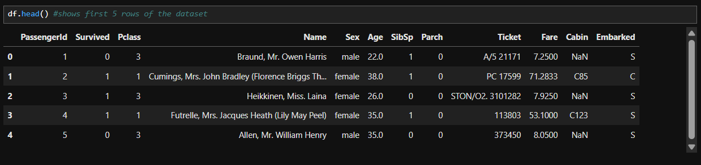
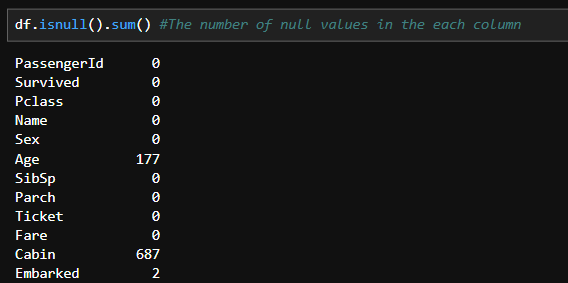
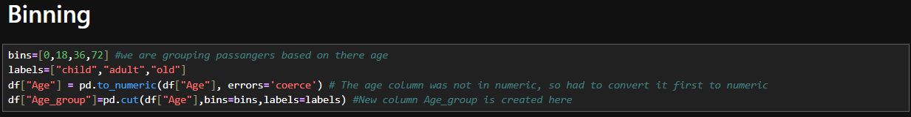
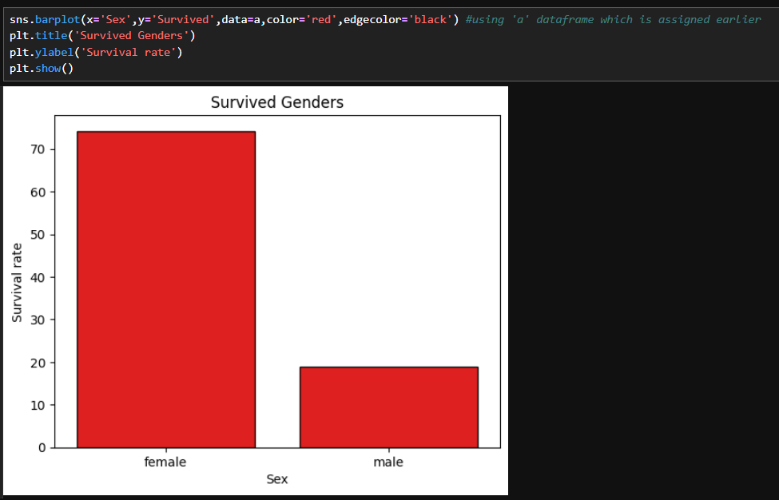

# Titanic Data Analysis (EDA)

## Overview
This project focuses on exploratory data analysis (EDA) of the Titanic dataset using Python.  
The work is being done as part of an internship.

## Objective
To understand the Titanic dataset, clean the data, perform exploratory analysis, and derive insights related to passenger survival using Python-based data analysis techniques.

## Tools & Libraries Used
- Python
- Pandas
- NumPy
- Matplotlib
- Seaborn

## Dataset
- Titanic Dataset (Kaggle)

## Steps Performed:
### 1. Data Loading & Inspection
- Loaded the dataset into Pandas DataFrames
- Checked shape, columns, data types, and basic statistics
- 

### 2. Data Cleaning
- Handled missing values
- Verified and corrected data types where required
- Removed or adjusted irrelevant or inconsistent data

### 3. Feature Engineering & Binning
- Applied binning on numerical variables (such as age and fare)
- Created categorical groups to analyze survival trends more effectively
- 

### 4. Exploratory Data Analysis (EDA)
- Analyzed survival rates across:
  - Gender
  - Passenger class
  - Age groups
- Used DataFrame operations to compute survival distributions
- 

### 5. Data Visualization
- Bar plots and count plots to compare survival rates
- Distribution plots to understand feature spread
- Visual comparisons to highlight key patterns in the data
- 

## Key Insights
- Female passengers had a significantly higher survival rate than male passengers
- Passengers in higher classes had better survival outcomes
- Certain age groups showed higher survival probabilities
- Binning helped reveal clearer survival trends across numerical features
